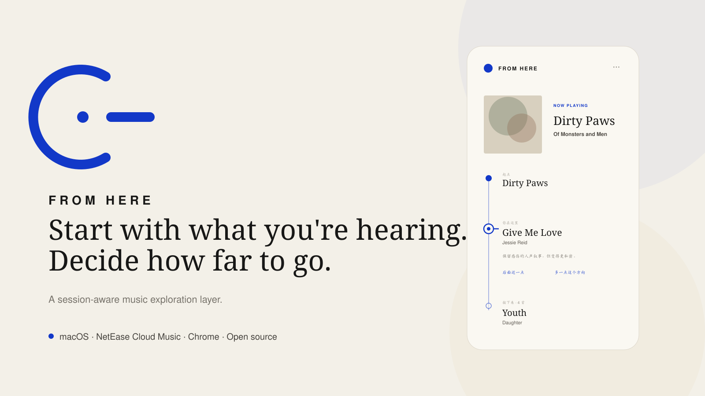
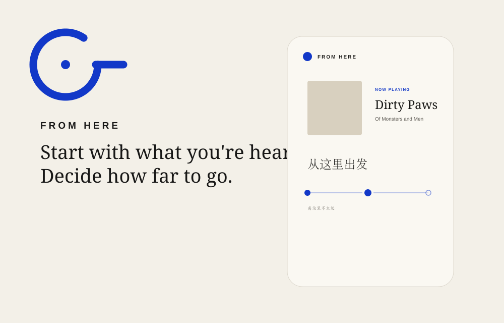

<p align="center">
  
</p>

<p align="center"><strong>从正在听的歌出发，决定想走多远。</strong></p>

<p align="center">macOS · NetEase Cloud Music · Chrome / Chromium · Open source</p>

<p align="center">Built by <strong>Jipeng Song / 宋吉鹏</strong> · <a href="https://nclcat.com">nclcat.com</a></p>

---

## Most recommendation systems remember taste. From Here follows state.

A recommendation system can know that you love Kent, Jay Chou and Of Monsters and Men. That still does not mean all three belong in the same moment.

**Preference ≠ Intent ≠ State.**

From Here treats the song playing **right now** as a temporary origin. It understands what makes that song feel like itself, asks how far you want to travel, and builds a continuous listening path without turning that temporary state into a permanent label about you.

<p align="center">
  
</p>

## See it happen

```text
THE SONG PLAYING NOW
        ●
        │
   understand
        │
   ┌────┴────┐
   │         │
 stay      explore
   │         │
   └── session ──→
```

The user controls one thing explicitly: **distance**.

`留在这里 ───────── 去看看`

Everything else can stay human. If needed, add one sentence such as:

> 更冷一点，不要华语，保持人声。

From Here turns that into temporary Session constraints internally.

## A path, not a playlist generator

During a Session, the UI is a route:

```text
●  Dirty Paws
│  Of Monsters and Men
│
◉  YOU ARE HERE
│  Give Me Love — Jessie Reid
│  保留感伤的人声叙事，但变得更私密。
│
○  Youth — Daughter
│
○  ...
```

The original track stays the **Anchor**. The currently playing recommendation is only a point on the path. The Session continues automatically; you do not have to approve every song.

Two optional corrections affect only what comes next:

- **后面近一点** — move future recommendations closer to the Anchor.
- **多一点这个方向** — strengthen the current positive signal without replacing the Anchor.

Feedback never skips the song currently playing.

## How it thinks

From Here does not ask an LLM to invent songs. NetEase remains the catalog and recall layer. AI is used to understand the moment and decide which real candidates belong in it.

```text
Current track
    ↓
Music Fingerprint
(vocal / timbre / falsetto / emotion / imagery / rhythm / dynamics / texture...)
    ↓
2–4 recall directions
    ↓
NetEase real candidate recall
    ↓
Perceptual continuity ranking
    ↓
Deterministic guards
(diversity / tribute / world breaks)
    ↓
Rolling runway of ~5 tracks
```

The ranking question is not **“what is most similar?”** It is:

> **What is the most natural next step from this song, for this moment?**

See [`docs/RECOMMENDATION.md`](docs/RECOMMENDATION.md) for the recommendation model.

## Install

The current release supports **NetEase Cloud Music desktop app on macOS + Chrome/Chromium Side Panel**.

### If you just want to use From Here

Download the macOS asset from **GitHub Releases** instead of GitHub's autogenerated Source ZIP.

The runtime package exposes only:

```text
From Here/
├── Install.command
├── Start.command
├── Chrome Extension/
├── README-FIRST.txt
└── Support/
```

1. Double-click `Install.command` and complete the guided NetEase / AI setup.
2. Open `chrome://extensions/` → Developer mode → **Load unpacked** → select `Chrome Extension/`.
3. Double-click `Start.command`, then play a song in the NetEase macOS app and open From Here.

The Bridge runs in the background; the Terminal window can be closed after startup.

### If you cloned the source repository

Requirements:

- Node.js 18+
- NetEase Cloud Music desktop app
- Chrome / Chromium
- `@music163/ncm-cli`
- `nowplaying-cli`

```bash
npm install -g @music163/ncm-cli
brew install nowplaying-cli
```

Then configure NetEase once:

```bash
ncm-cli configure
ncm-cli login
ncm-cli config set player orpheus
```

Run `Install.command`, load `extension/` in Chrome, then run `start.command`.

From Here does **not** store your NetEase credentials; they remain managed by `ncm-cli`.

## AI model behavior

Default behavior is **follow local configuration**.

If you already use Claude Code or a compatible local environment, From Here attempts to reuse its Provider, credentials and explicit model. An explicit local model always wins; `/models` discovery is not allowed to silently replace it.

You can override it with `configure-ai.command`.

Supported adapters:

- OpenAI-compatible `/chat/completions`
- Anthropic-compatible `/messages`
- automatic protocol discovery
- no AI / local ranking fallback

Secrets stay in `bridge/config.local.json`, which is ignored by Git.

## For developers

```bash
cd bridge
npm test
```

Regression coverage includes provider adapters, local-model priority, media-state persistence, resumable UI jobs, feedback-without-skipping, rolling auto-refill, the Dirty Paws tribute bad case, perceptual world-break protection and AI Session flow.

UI-only Mock mode:

```text
start-mock.command
```

Live environment / Session diagnostics:

```text
diagnose.command
```

### Architecture

```text
extension/
  Side Panel / path UI
       │
       ▼
bridge/server.js
  Session orchestration
       │
       ├── prompts/music-semantic.js
       ├── providers/
       ├── ncm-cli       real recall + queue
       └── nowplaying-cli current macOS track
```

### Build the user release

```bash
./scripts/build-release.sh
```

The release builder strips tests, CI, design docs and source-only files, hides the runtime Bridge, and rejects local secrets/cache before producing the macOS ZIP.

## Identity

The From Here mark is an **open disc**: part record, part origin, part exit.

- `#1238C8` — From Here Blue
- `#171716` — Carbon
- `#F3F0E8` — Warm Paper

Album artwork may softly tint the atmosphere, but the brand skeleton stays blue. The product avoids generic AI gradients, sparkle icons, waveform clichés and card-heavy dashboards.

> **The song determines the air. From Here determines the skeleton.**

Brand sources and usage rules live in [`brand/BRAND.md`](brand/BRAND.md).

## GitHub presentation

The repository includes ready-to-use assets:

- `brand/github-hero.png` — README hero
- `brand/social-preview.png` — GitHub Social Preview, 1280×640
- `brand/demo.gif` — lightweight product demo
- `brand/icon.svg` / `brand/mark.svg` — brand sources

Recommended repository description and Topics are in [`docs/GITHUB-PUBLISH.md`](docs/GITHUB-PUBLISH.md).

## About the maker

Hi, I’m **Jipeng Song / 宋吉鹏**, a product builder working at the intersection of consumer product sense, AI productization, and agent experiences. I like taking ambiguous ideas all the way from a product thesis and interaction model to working software.

From Here came from a simple frustration: recommendation systems remember what we liked before, but often fail to understand what belongs to **this moment**. I built it as both a working product and an exploration of a broader product idea — software should respond to temporary human state instead of hardening every past signal into a permanent preference.

I write about AI, products, cognition, and building at **[nclcat.com](https://nclcat.com)**.

**Contact:** [jiangji628@gmail.com](mailto:jiangji628@gmail.com)

## Security

Never commit API keys, private keys, tokens/cookies, `bridge/config.local.json`, `.env`, or runtime `.data/`. See [`SECURITY.md`](SECURITY.md).

## Status

**v1.0.0 — First public release.** The supported 1.0 path is macOS + NetEase Cloud Music + Chrome/Chromium. Recommendation calibration will keep evolving, but the product thesis, Session model, path UI, local Bridge architecture and release packaging are now stable enough for public use and contribution.

## License

MIT.
